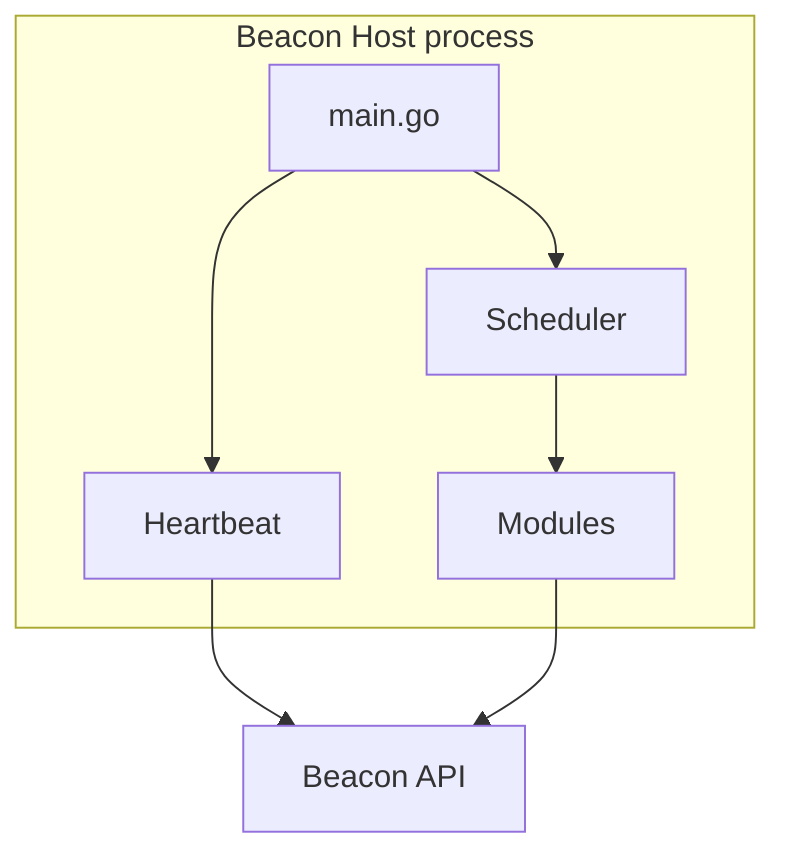

**Beacon Host** is the endpoint collector in the Beacon platform. One binary per machine — registers once, runs continuously, and ships evidence to Beacon API.

## Capabilities

| Capability | Module |
|------------|--------|
| CIS benchmark scans | `cis` |
| CVE detection (Trivy) | `vuln` |
| Asset inventory | `inventory` |
| Security event logs | `logs` |
| File integrity monitoring | `fim` (optional) |

## Architecture

## Bootstrap on first connect

| Dependency | Platform |
|------------|----------|
| Trivy | All (auto-download) |
| OpenSCAP + SCAP content | Linux (apt attempt) |
| mSCP CIS script | macOS (git clone) |
| Built-in CIS checks | Linux/Windows fallback |

## Binary

| Item | Value |
|------|-------|
| Repository | [beacon-host-agent](https://github.com/fynx-security/beacon-host-agent) |
| Go module | `github.com/fynx-security/beacon-host-agent` |
| Build output | `bin/beacon-host-agent` |

## Related

- [Modules](/agents/beacon-host/modules)
- [Platform support](/agents/beacon-host/platform-support)
- [Install guide](/guides/install-beacon-host)
