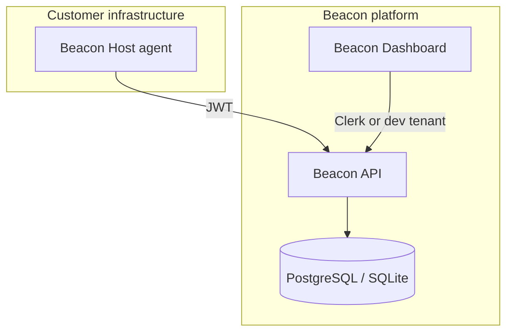
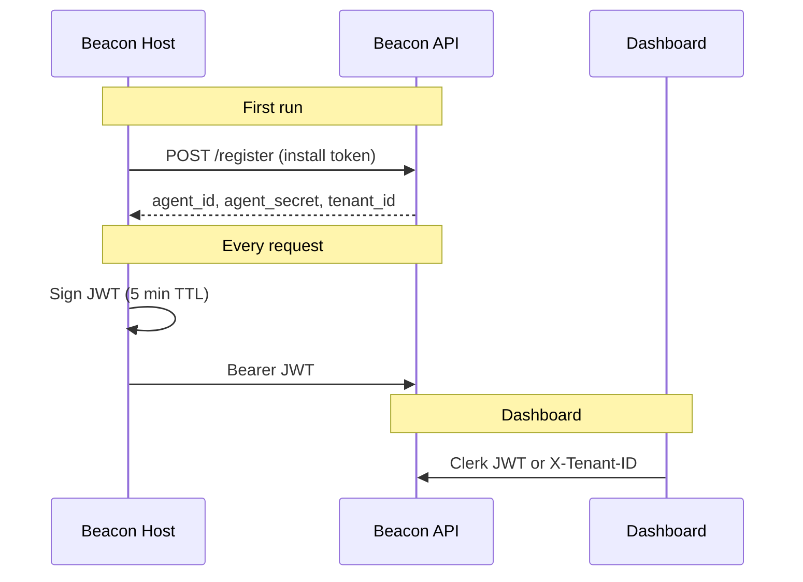

Beacon follows a simple **collector → platform → evidence** model. Agents push structured results; the API stores, scores, and alerts; the dashboard presents posture and exports audit packs.

## Components

### Beacon Host

A Go daemon installed on servers and workstations. It:

- Registers once with an **install token**
- Authenticates with short-lived **JWTs** signed by its secret
- Pulls **remote config** every 5 minutes
- Runs scheduled **modules** (CIS, vuln, inventory, logs, FIM)
- Sends **heartbeats** and receives **remote commands**

[Beacon Host reference →](/agents/beacon-host/overview)

### Beacon API

A FastAPI service with two audiences:

| Router | Prefix | Auth | Purpose |
|--------|--------|------|---------|
| Agent | `/api/agent` | Agent JWT | Registration, events, heartbeat, logs |
| Dashboard | `/api` | Clerk JWT or `X-Tenant-ID` (dev) | Fleet, compliance, alerts, evidence |
| Installer | `/install.sh`, `/releases` | None | Bootstrap scripts |

[API reference →](/api-reference/introduction)

### Beacon Dashboard

A Next.js app that proxies dashboard API calls (Clerk session in production). Pages cover fleet management, CIS/vuln views, log monitoring, compliance scoring, and evidence export.

[Dashboard guide →](/dashboard/overview)

## Data lifecycle

<Steps>
  <Step title="Registration">
    Admin creates install token → agent calls `POST /api/agent/register` → credentials stored on host and `Agent` row created in DB.
  </Step>
  <Step title="Collection">
    Scheduler runs modules → results posted to `POST /api/agent/events` with module-specific JSON payloads.
  </Step>
  <Step title="Processing">
    API normalizes events into snapshots (CIS, vulns, inventory, FIM) or security log rows. Log batches trigger the **rules engine**.
  </Step>
  <Step title="Scoring">
    Compliance service aggregates snapshots and alerts into five **Article 21 controls** and an overall score.
  </Step>
  <Step title="Evidence">
    On demand, API builds JSON or PDF **audit packs** from current tenant state.
  </Step>
</Steps>

## Authentication model

<Warning>
  Install tokens are **single-use** and expire after 24 hours. Treat `agent_secret` like a password — it signs all agent JWTs.
</Warning>

## Multi-tenancy

Every row is scoped by `tenant_id` (Clerk organization ID in production). Agents belong to exactly one tenant. Dashboard users only see their organization's fleet and evidence.

## Retention and limits

| Data | Policy |
|------|--------|
| Security log events | 7-day retention, max 2,000 per agent, deduped 24h |
| Log ingest batch | Max 50 security-relevant events per batch |
| Alerts | Deduped per rule (30 min window) |

See [Security events](/concepts/security-events) for filtering details.

## Repository map

| Repo | Contains |
|------|----------|
| [beacon-host-agent](https://github.com/fynx-security/beacon-host-agent) | Go agent |
| [beacon-api](https://github.com/fynx-security/beacon-api) | FastAPI backend |
| [beacon-dashboard](https://github.com/fynx-security/beacon-dashboard) | Next.js UI |
| [beacon-docs](https://github.com/fynx-security/beacon-docs) | This documentation |

## Related

- [Agents concept](/concepts/agents)
- [Tenants and auth](/concepts/tenants-and-auth)
