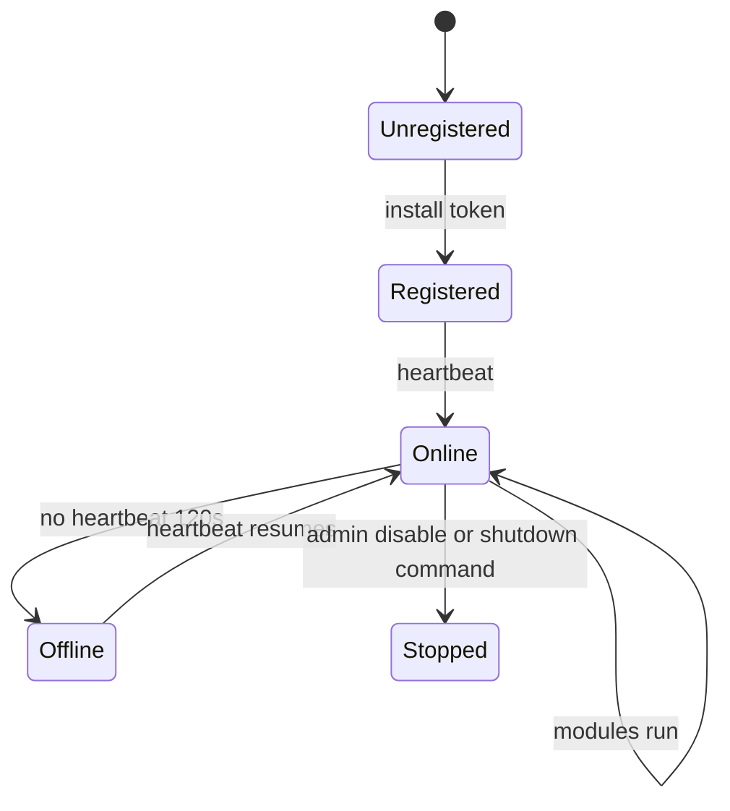

Agents are lightweight daemons that run on customer infrastructure. They collect structured **evidence** and ship it to Beacon API — they do not expose an inbound admin port.

## Agent types

| Agent | Status | Runs on |
|-------|--------|---------|
| **Beacon Host** | Available | Linux, macOS, Windows servers and endpoints |
| **Beacon Cluster** | Planned | Kubernetes clusters |

Each agent type is a separate binary with its own release cycle, but all report to the same Beacon platform and tenant.

## Lifecycle

### Registration

1. Admin generates an **install token** in the dashboard.
2. Agent runs with `--token=...` and `NIS2_PLATFORM_URL`.
3. API validates token, creates `Agent` record, returns credentials.
4. Agent stores credentials locally and never needs the install token again.

### Heartbeat

Default interval: **60 seconds** (configurable via remote config).

Each heartbeat:

- Updates `last_seen` on the agent record
- Returns pending **remote commands** (`run_module`, `restart`, `fetch_logs`, `shutdown`)
- Returns `enabled` flag — disabled agents pause their scheduler

Dashboard marks agents **online** when `last_seen` is within **120 seconds**.

### Remote config

Agents poll `GET /api/agent/config` every **5 minutes**. Config includes:

- Per-module `enabled` flag
- `interval_seconds` or cron `schedule`
- Tenant and agent identifiers

Changes apply without reinstalling the agent.

## Remote commands

Admins can queue commands per agent or per **agent group**:

| Command | Effect |
|---------|--------|
| `run_module` | Immediately run a named module (e.g. `cis`) |
| `fetch_logs` | Flush agent stdout logs to platform |
| `restart` | Agent process restart |
| `shutdown` | Stop agent process |

Commands flow: dashboard → API → next heartbeat → agent execution → completion callback.

## Self-update

Beacon Host checks `GET /api/agent/version` every **6 hours**. When the platform advertises a newer version with download URL and SHA256, the agent can replace its binary automatically.

## What agents do not do

- Inbound remote shell or RDP
- Kernel-level hooking (EDR-style)
- Full log lake ingestion
- Real-time streaming of all OS events

Beacon Host applies **filters and caps** before upload. See [Security events](/concepts/security-events).

## Related

- [Beacon Host overview](/agents/beacon-host/overview)
- [Install Beacon Host](/guides/install-beacon-host)
- [Manage fleet](/guides/manage-fleet)
