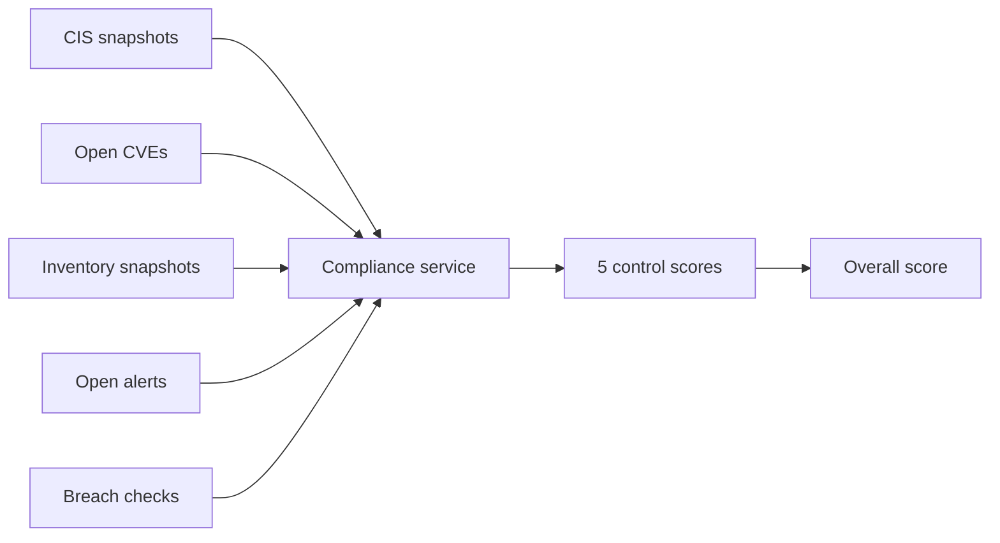

Beacon computes an **automated compliance score** from agent-collected evidence. Scores support your NIS2 program — they do not constitute legal certification.

## Framework

| Field | Value |
|-------|-------|
| Framework ID | `nis2` |
| Basis | NIS2 **Article 21** security measures (simplified mapping) |
| Overall score | Average of five control scores |
| Status colors | Green ≥80 · Amber ≥60 · Red &lt;60 |

## The five controls

| Control | Label | Primary inputs |
|---------|-------|----------------|
| `21_2_f_cis` | Security configuration (CIS) | Average CIS benchmark score across agents |
| `21_2_f_vuln` | Vulnerability management | Age and severity of open critical CVEs |
| `21_2_j_inventory` | Asset inventory | % of agents with inventory snapshot in last 7 days |
| `21_2_b_logging` | Security monitoring & logging | Open critical/high alerts and staleness |
| `21_2_h_credentials` | Credential exposure | Breach monitor results for watched emails |

[Detailed control formulas →](/compliance/controls)

## Score calculation flow

Scores refresh when:

- Dashboard loads the Compliance page
- Evidence pack or PDF is generated
- Underlying data changes (no separate batch job)

## Interpreting scores

<Tip>
  Treat scores as **directional indicators** for prioritization and audit narrative, not pass/fail certification.
</Tip>

| Pattern | Likely meaning |
|---------|----------------|
| CIS red, vuln green | Hardening gaps but patching is current |
| Inventory red | Agents connected but inventory module not running |
| Logging red | Critical alerts open or high alerts stale >7 days |
| Credentials amber | Monitored emails configured; some breach hits |

## Improving scores

| Control | Actions |
|---------|---------|
| CIS | Fix failed checks; re-run CIS module |
| Vuln | Patch or mark CVEs resolved in dashboard |
| Inventory | Ensure inventory module enabled (default 5 min interval) |
| Logging | Triage and resolve alerts in Log Monitoring |
| Credentials | Add emails to Breach Monitor; rotate exposed credentials |

## Evidence linkage

Compliance scores appear in:

- Dashboard **Compliance** page
- JSON **audit pack** (`GET /api/compliance/evidence`)
- PDF **compliance report** (`GET /api/compliance/evidence/report`)

[Export compliance report →](/guides/export-compliance-report)

## Related

- [NIS2 Article 21 context](/compliance/nis2-article-21)
- [Control formulas](/compliance/controls)
