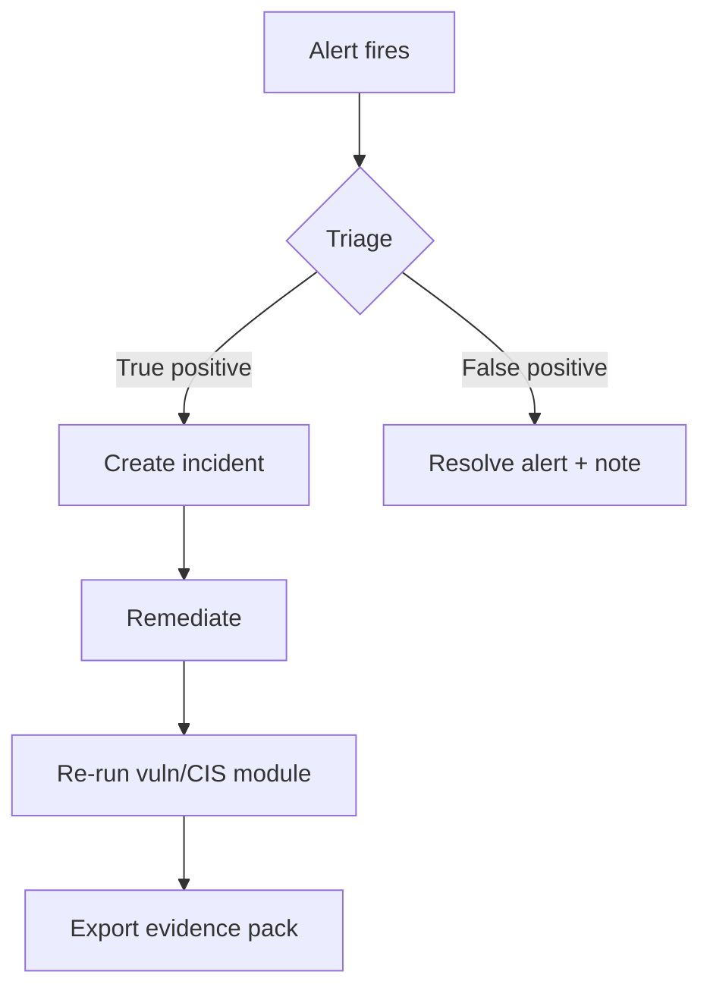

Beacon includes lightweight **workflow** features — not full SOAR — for NIS2 incident handling evidence.

## Incidents register

**Compliance → Incidents**

Create incidents manually to track:

- Title and description
- Severity
- Status (`open`, `investigating`, `resolved`)
- Linked context from alerts

Use for internal NIS2 **incident documentation** and 24/72h notification prep — not automated regulatory filing.

## Alert remediation

**Monitoring → Log Monitoring**

| Action | Effect |
|--------|--------|
| Resolve alert | Marks alert closed; improves logging control score |
| View rule | Shows detection rule ID and matched event context |

```bash
PATCH /api/alerts/{id}
{ "status": "resolved" }
```

## Vulnerability remediation

**Security Posture → Vulnerabilities**

Mark CVEs when patched or accepted:

```bash
PATCH /api/vulnerabilities/{id}
{ "status": "resolved" }
```

Open critical CVE age directly affects the **vulnerability management** control score.

## Recommended workflow



## Related

- [Security events](/concepts/security-events)
- [Compliance scoring](/concepts/compliance-scoring)
- [Incidents API](/api-reference/dashboard/incidents)
